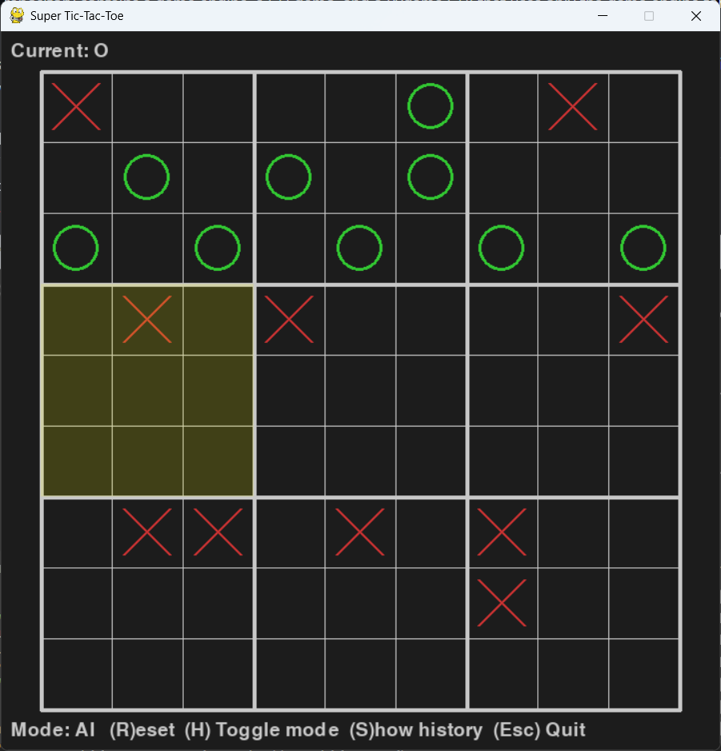

# Super Tic-Tac-Toe AI Bot

A compact project implementing "Super Tic-Tac-Toe" (also called Ultimate Tic‑Tac‑Toe) with a minimax-based AI. The repository contains a game engine, a CLI demo, and a Pygame GUI that uses only the game engine for game logic and AI decisions.

This README explains how to run the project, what each file does, how the GUI works (controls and behavior), and a few notes for contributors.

## Screenshot

Below is a reference screenshot of the Pygame GUI (included as an attachment in the project). It shows a 3×3 grid of 3×3 boards, an highlighted "next board", and a drawn X in the top-left cell:



## Quick start

1. Create and activate a virtual environment (recommended):

```bash
python -m venv .venv
source .venv/Scripts/activate   # Windows (bash)
```

2. Install requirements:

```bash
pip install -r requirements.txt
```

3. Run the GUI (Pygame):

```bash
python gui_game.py
```

4. Run the CLI (terminal):

```bash
python cli_game.py
```

## Project files

- `game_engine.py` — Core game model. Exposes `SuperBoard`, `Board`, `Strategy`, and constants `X`/`O`. All game state, move validation, winner checks and history recording live here. The GUI and CLI use only this module for game logic.
- `Minimax.py` — Minimax implementation with alpha–beta pruning and a heuristic. `Strategy.minimax_pick` in `game_engine.py` calls into this.
- `cli_game.py` — Simple terminal-based play. Human vs AI by default (human plays 'O'). Useful for quick tests and debugging.
- `gui_game.py` — Pygame-based graphical interface. The GUI uses only `game_engine.py` to query state and submit moves.
- `requirements.txt` — Declares `pygame` (for the GUI) and `pandas` (used by `game_engine` history export).

## Rules of Super Tic-Tac-Toe

This project implements the standard rules for "Super Tic-Tac-Toe" (sometimes called Ultimate Tic‑Tac‑Toe). The rules are summarized below so you can understand how the GUI and engine enforce moves.

- Board layout: The game board is a 3×3 grid of small 3×3 Tic‑Tac‑Toe boards (so 9 small boards total). We'll call each small board a "local board" and the overall 3×3 arrangement the "global board." Each cell in a local board can contain X, O, or be empty.

- Players and turns: Players alternate turns placing their symbol (X or O) in an empty cell on any allowed local board. In this project the CLI/GUI default is human = O and AI = X (mirroring the CLI demo), but the engine itself is neutral.

- Forced board rule (the key twist): When a player makes a move in a local board at position p (positions are numbered 0–8 inside each 3×3 local board), that position index selects the local board that the next player must play in. Example: if you play in the top-right cell (position 2) of any local board, the next player must play in the local board at index 2 of the global board.

- When the forced local board is already won or completely filled, the next player may play in any local board that is not yet won and has empty cells.

- Local board wins: A local board is won when a player gets three in a row inside that local board (standard tic‑tac‑toe lines). Once a local board is won, its owner (X or O) is treated as the owner of that local board for the purposes of the global board. The engine prevents further moves in cells of a won local board.

- Global win: The global board is won when a player owns three local boards in a row on the global 3×3 (horizontal, vertical, or diagonal). When the global win condition is met, the game ends and that player is the global winner.

- Draws: If every local board is either won or full and no player has three owned local boards in a row, the game is a draw.

- Example play sequence:
  1. X starts and plays in local board 4 (center board), position 0 (top-left). This forces O to play in global local board 0 (top-left local board) next.
  2. O must now play inside local board 0. If O plays position 8 (bottom-right) on board 0, X's next move must be in local board 8, and so on.

The `game_engine.SuperBoard` enforces these rules: `make_move(position, board)` applies a move, updates `next_board`, and prevents illegal moves (occupied cells or playing in a wrong forced local board).

## Controls and UI behavior (Pygame GUI)

- Click a cell to place your mark. The GUI maps a left-click to a (board_index, cell_index) pair and calls `SuperBoard.make_move`.
- The current player is shown at the top-left. When a local board is won, its owner contributes to the global board; when a global 3-in-a-row is formed, the game ends with that winner.
- "Next board" highlighting: when a move is made in position p within a small board, the next player must play in the small board at index p (unless that board is already won or full). The GUI draws a translucent highlight over the active small board.
- Keyboard shortcuts:
  - R: Reset the game
  - H: Toggle mode between Human-vs-AI (default) and Human-vs-Human
  - S: Print the move history (Pandas DataFrame) to the console
  - Esc: Quit

## AI behavior

- The AI uses `Strategy.minimax_pick` which delegates to the minimax implementation in `Minimax.py`. The default depth has been set to a low value in the minimax code for performance; you can increase depth in `gui_game.py` when calling `Strategy.minimax_pick` to make the AI stronger at the cost of speed.
- When playing human vs AI, the CLI and GUI both assume the human plays 'O' and the AI plays 'X' (this matches the original CLI demo behavior).

## Development notes

- The GUI intentionally calls only public-facing parts of `game_engine.py` (`SuperBoard`, `Strategy`, `X`, `O`) so the game logic is centralized and tested separately from presentation.
- The `game_engine` exposes `history_df()` which returns a Pandas DataFrame of the move history; this is helpful for debugging and analysis.
- If you want to experiment with alternate AIs, update `Minimax.minimax` or add new strategies in `game_engine.Strategy` and call them from `gui_game.py`.

## Testing and quick verification

1. Start the GUI and play a few moves. Use R to reset and H to toggle modes.
2. Run the CLI to validate the core engine behaviour independently of the GUI.

### Automated tests (pytest)

This repository includes a small pytest test module at `tests/test_super_tictactoe.py` that exercises basic functionality of the `game_engine`:

- `test_initial_state` — asserts the initial `SuperBoard` state (current player, no winners, empty mini-boards).
- `test_make_move` — verifies making a move updates the correct local cell and toggles the current player.
- `test_winner_row` — verifies that a local board correctly detects a horizontal win and sets its `winner`.

To run the tests from the project root:

```bash
pytest tests/test_super_tictactoe.py
```

If you want to run all tests in the repository, simply run `pytest` with no arguments.

## Extending the project

- Add unit tests around `SuperBoard` methods (move generation, winner detection, cloning) using pytest.
- Add a small options dialog to `gui_game.py` to control AI depth, starting player, or enable AI vs AI mode.
- Persist and replay games using `SuperBoard.history_df()` and the File parsing helpers in `game_engine.File`.

## Example board file (`example.txt`)

The repository includes an example board file at `assets/example.txt` which demonstrates the plain-text format that `game_engine.File.parse_board` can read. This file format is human-readable and useful for saving or loading partially-played games for debugging or analysis.

Key parts of the format:

- `Current Player: X` — the player who will move next (X or O).
- `Active Board: (r, c)` — optional; the 1-indexed (row, column) coordinates of the forced local board (for example `(2, 1)` means the local board at global index 3). If omitted or invalid, the engine will treat next board as unset.
- `Boards:` — followed by nine labeled local boards in row-major order using coordinates `(row,col)` starting at `(1,1)` for the top-left local board. Each local board is represented by three lines with `X`, `O`, or `.` for empty cells.

Example excerpt (from `assets/example.txt`):

```
Current Player: X
Active Board: (2, 1)

Boards:

(1,1)
X O .
. X .
. . O
```

How to load it in Python:

```python
from game_engine import File

sb = File.parse_board('assets/example.txt')
print(sb)          # prints a human-friendly board view
print(sb.next_board)  # index (0–8) of the forced local board or None
```

Notes on coordinate mapping:

- The file uses (row, column) with 1-based coordinates for local boards. The engine maps these to internal board indices with the formula: index = (row-1)\*3 + (column-1). For example `(1,1)` → 0, `(1,2)` → 1, `(2,1)` → 3, `(3,3)` → 8.
- The local board rows themselves are normal 3×3 grids, read left-to-right, top-to-bottom. Dots (`.`) represent empty cells.

You can create more files in this format to test different game states and load them with `game_engine.File.parse_board` for debugging or to feed into automated tests.
